# ipa-gpo-install - Group Policies for FreeIPA

**English** | [Русский](./README.ru.md)

## Description

**ipa-gpo-install** is a tool for integrating group policy functionality into FreeIPA. The package extends the LDAP schema with necessary objects and provides CLI and WEB interfaces for managing group policies.

## How it works

### Group Policy Concept

Group Policies in FreeIPA work on the principle of **multi-level inheritance of settings**. The system consists of three main components:

1. **Policies** - sets of rules and settings

2. **Chains** - linking element that defines policy assignment to user and computer groups and their application sequence

3. **Group Policy Master** - object that stores ordered list of all chains in the system and defines the main server for policy management

#### Policy Priority Determination

When a user logs into the system, policies are applied in a strictly defined sequence:

1. **Chain processing** - system processes chains in the order specified in the Group Policy Master
2. **Membership filtering** - for each chain, system checks if it matches the current user and computer
3. **Policy priority within chain** - if chain matches, policies from it are processed in the order of their sequence in the `gpLink` attribute

#### Priority Management

Priorities are configured at two levels:

**Chain level in Master:**
- Chain order is determined by their position in the `chainList` attribute of the master
- Chains higher in the list have higher priority

**Policy level within chain:**
- Policy order is determined by their position in the `gpLink` attribute of the chain
- Policies higher in the list have higher priority
- In case of setting conflicts, the policy with higher priority takes effect

### Implementation Structure

#### Group Policy Container (GPC)
Container with settings and rules. Each GPC contains:
- Unique identifier (GUID)
- Name
- Reference to settings directory in Sysvol
- Policy version for tracking changes

#### Group Policy Chain
Linking element between groups and policies. Chain defines:
- Which user group will receive settings
- Which computer group will receive settings
- Which specific policies are linked to user and computer groups
- In what order policies are applied to members of linked groups

#### Group Policy Master
Central management object that:
- Maintains registry of all active chains in the system
- Defines the main server for policy management
- Maintains correct chain processing order

Master ensures consistency and coordination of the entire group policy system.

### Group Policy Inheritance Scheme

```mermaid
graph TD
    classDef userClass fill:#e3f2fd,stroke:#1565c0,stroke-width:3px
    classDef masterClass fill:#f3e5f5,stroke:#7b1fa2,stroke-width:3px
    classDef chainClass fill:#fff3e0,stroke:#f57c00,stroke-width:2px
    classDef gpcClass fill:#fce4ec,stroke:#c2185b,stroke-width:2px
    classDef resultClass fill:#e8f5e8,stroke:#2e7d32,stroke-width:3px

    subgraph MasterLayer ["🏛️ MASTER LAYER"]
        Master["Group Policy Master<br/>chainList:<br/>1. dev-chain<br/>2. office-chain"]
    end

    subgraph ChainLayer ["🔗 CHAIN LAYER"]
        direction LR
        ChainDev["dev-chain<br/>userGroup: developers<br/>computerGroup: dev-workstations<br/>gpLink:<br/>1. policy-1<br/>2. policy-2"]
        ChainOffice["office-chain<br/>userGroup: office-users<br/>computerGroup: office-computers<br/>gpLink:<br/>1. policy-3<br/>2. policy-4"]
    end

    subgraph GPCLayer ["📋 GPC LAYER"]
        direction LR
        GPC1["policy-1<br/>{GUID-1}"]
        GPC2["policy-2<br/>{GUID-2}"]
        GPC3["policy-3<br/>{GUID-3}"]
        GPC4["policy-4<br/>{GUID-4}"]
    end

    subgraph UserSide ["👤 User/Computer"]
        User["User: john<br/>Groups:<br/>• developers<br/>• office-users"]
        Computer["Computer: ws001<br/>Groups:<br/>• dev-workstations<br/>• office-computers"]
    end

    Master -.->|"1"| ChainDev
    Master -.->|"2"| ChainOffice

    ChainDev -.->|"1"| GPC1
    ChainDev -.->|"2"| GPC2
    ChainOffice -.->|"1"| GPC3
    ChainOffice -.->|"2"| GPC4

    class Master masterClass
    class ChainDev,ChainOffice chainClass
    class GPC1,GPC2,GPC3,GPC4 gpcClass
    class User,Computer userClass
```



The diagram demonstrates the group policy inheritance process using the example of user `john` and computer `ws001`.

#### Group Membership

**User john** belongs to groups:
- `developers`
- `office-users`

**Computer ws001** belongs to groups:
- `dev-workstations`
- `office-computers`

#### Determining Suitable Chains

Since the user and computer belong to groups from **both** chains, the system identifies two suitable chains:

1. **dev-chain** - matches because:
   - john ∈ developers (userGroup)
   - ws001 ∈ dev-workstations (computerGroup)

2. **office-chain** - matches because:
   - john ∈ office-users (userGroup)
   - ws001 ∈ office-computers (computerGroup)

#### Policy Sequence

**Step 1: Chain Order**
Group Policy Master defines processing order through the `chainList` attribute:
```
1. dev-chain (first in list)
2. office-chain (second in list)
```

**Step 2: Policies from dev-chain**
In order of `gpLink` attribute:
```
1. policy-1 (priority 1)
2. policy-2 (priority 2)
```

**Step 3: Policies from office-chain**
In order of `gpLink` attribute:
```
3. policy-3 (priority 1)
4. policy-4 (priority 2)
```

#### Final Sequence

User `john` on computer `ws001` will receive policies in the following order:
```
policy-1 → policy-2 → policy-3 → policy-4
```

#### Sequence Explanation

1. **First all policies from dev-chain** - because this chain is first in master's `chainList`
2. **Then all policies from office-chain** - because this chain is second in master's `chainList`
3. **Within each chain** policies are in the order of their sequence in `gpLink`
4. **In case of setting conflicts** the last policy takes precedence (in this case from policy-1)

This approach provides predictable and controlled policy inheritance with flexible priority management at two levels: chain level and policy level within chain.

## Installation

### Requirements

- FreeIPA server
- Administrator rights
- Valid Kerberos ticket

## Installing RPM package
    # apt-get install freeipa-server-gpo

## Getting Kerberos ticket
    # kinit admin

## Configuring group policies
    # ipa-gpo-install

### Installation parameters

    # ipa-gpo-install [OPTIONS]

Options:
  --debuglevel LEVEL   Debug level: 0=errors, 1=warnings, 2=debug
  --check-only         Check only without making changes
  --help               Show help

### What the installer does

1. **Extending LDAP schema** - adds new object classes for group policies
2. **Creating SYSVOL structure** - creates directories for storing policy files
3. **Configuring Samba** - creates SYSVOL share

## Technical implementation

### LDAP Schema
- `cn` - Policy GUID
- `displayName` - Display name of policy
- `distinguishedName` - Object DN
- `flags` - Policy flags
- `gPCFileSysPath` - Path to policy files in SYSVOL
- `versionNumber` - Policy version number

**groupPolicyContainer (GPC)**
- `cn` - Policy GUID
- `displayName` - Display name of policy
- `distinguishedName` - Object DN
- `flags` - Policy flags
- `gPCFileSysPath` - Path to policy files in SYSVOL
- `versionNumber` - Policy version number

**groupPolicyChain**
- `cn` - Chain name
- `displayName` - Display name of chain
- `userGroup` - User group DN
- `computerGroup` - Computer group DN
- `gpLink` - Ordered list of policy DNs

**groupPolicyMaster**
- `cn` - Master object name
- `pdcEmulator` - PDC emulator DN
- `chainList` - Ordered list of policy chains

## Management commands

### Policy management

#### Creating policy
    # ipa gpo-add office-security-policy

#### Viewing policy
    # ipa gpo-show office-security-policy

#### Modifying policy
    # ipa gpo-mod office-security-policy --rename="new-security-policy"

#### Deleting policy
    # ipa gpo-del new-security-policy

#### Finding policies
    # ipa gpo-find [CRITERIA]

### Policy chain management

#### Creating chain
    # ipa chain-add it-chain \
    --display-name="IT Department Chain"
    --user-group=it-users
    --computer-group=it-workstations
    --gp-link=policy1

#### Viewing chain
    # ipa chain-show it-chain --raw

### Modifying chain

**Basic modifications:**
    # ipa chain-mod it-chain \
    --display-name="New Display Name"
    --user-group=new-user-group
    --computer-group=new-computer-group

**Adding groups:**
    # ipa chain-mod it-chain --add-user-group=developers
    # ipa chain-mod it-chain --add-computer-group=dev-machines

**Removing groups:**
    # ipa chain-mod it-chain --remove-user-group
    # ipa chain-mod it-chain --remove-computer-group

**Working with policies in chain:**

### Adding policies
    # ipa chain-add-gpo it-chain --gpos security-policy
    # ipa chain-add-gpo it-chain --gpos printer-policy

### Removing policies
    # ipa chain-remove-gpo it-chain --gpos security-policy

### Deleting chain
    # ipa chain-del it-chain

### Finding chains
    # ipa chain-find [CRITERIA]

## Priority management

### Viewing current order
    # ipa chain-show policy-chain

### Moving policy up (increasing priority)
    # ipa chain-mod it-chain --moveup-gpc="security-policy"

### Moving policy down (decreasing priority)
    # ipa chain-mod it-chain --movedown-gpc="security-policy"

## Group Policy Master management

#### Viewing Group Policy Master
    # ipa gpmaster-show

#### Adding chain to master
    # ipa gpmaster-mod master-name --add-chain=chain-name

#### Removing chain from master
    # ipa gpmaster-mod master-name --remove-chain=chain-name

### Moving chain up (increasing priority)
    # ipa gpmaster-mod master-name --moveup-chain=chain-name

### Moving chain down (decreasing priority)
    # ipa gpmaster-mod master-name --movedown-chain=chain-name

### Configuring PDC Emulator
    # ipa gpmaster-mod master-name --pdc-emulator=server-name

## Web interface

The extension includes a full-featured web interface integrated into the FreeIPA administrative panel.

### Main features

- **Policy chain management**: creation, editing, enabling/disabling
- **Priority management**: changing chain and GPO order
- **GPO object management**: creation, editing, deletion with automatic file structure processing
- **Group linking**: assigning chains to user and computer groups

### Integration

- New "Group Policy" section in FreeIPA menu
- Support for access rights system with "Group Policy Administrators" role
- Standard FreeIPA interface components

## File structure

### SYSVOL
After installation, directory structure is created:
/var/lib/freeipa/sysvol/
└── domain.example.com/
├── Policies/
│ └── {GUID}/
│ ├── GPT.INI
│ ├── Machine/
│ └── User/


### Policy files
Each policy creates structure in SYSVOL:
- `GPT.INI` - policy metadata
- `Machine/` - settings for computers
- `User/` - settings for users

## Access rights

### Roles and privileges
System creates special role **Group Policy Administrators** with rights:
- Read all group policy objects
- Create, modify and delete policies
- Manage policy chains

### Assigning rights
    # ipa role-add-member "Group Policy Administrators" --users=username

## System features

### Data integrity verification

**When adding objects:**
- Adding GPC and groups is performed with verification of their existence in LDAP database

**When deleting objects:**
- When deleting GPC or groups, references in chains are automatically removed by referential integrity plugin
- When deleting chain, it is automatically removed from gpmaster object